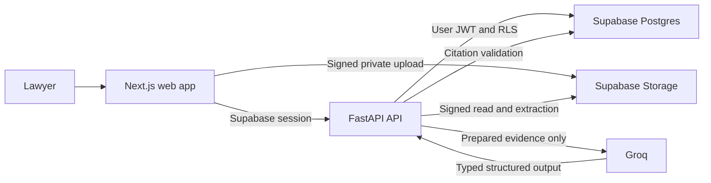

# CasePilot AI

CasePilot AI is a source-linked case-preparation workspace for lawyers and legal teams. It turns private case documents into a structured brief, timeline, issues, reviewable facts, follow-up tasks, and evidence-grounded case chat while keeping the lawyer in control of every decision.

Built by **Team MIB, KLE Technological University**, for the 24-hour Build for Billions Agentic AI prototype challenge.

## Why CasePilot

Legal case preparation often requires repeatedly reading the same files, reconciling conflicting accounts, locating dates and payments, and tracking missing records. CasePilot organizes that work into one review workspace:

- Upload private PDF, DOCX, and TXT evidence.
- Extract stable, source-addressable passages.
- Add optional lawyer-provided context that remains separate from evidence.
- Generate a cited case summary, document summaries, fields, parties, timeline, conflicts, gaps, and proposed tasks.
- Confirm, edit, or reject AI-extracted fields and parties without overwriting the original suggestion.
- Manage AI-proposed and manually created tasks.
- Ask case-scoped questions and receive cited evidence answers or clearly labeled general guidance.
- Navigate every factual citation back to the source document and passage.

CasePilot supports legal preparation. It does not make legal decisions, resolve disputed facts, provide autonomous legal advice, or take external actions.

## Product workflow

1. A user signs in through Supabase Auth and creates a case.
2. The user uploads up to 50 documents, with a maximum size of 50 MB per file.
3. The browser uploads supported files directly to private Supabase Storage through signed URLs.
4. FastAPI extracts stable passages from PDF, DOCX, and TXT documents.
5. The lawyer may enter optional background or questions as **Lawyer-provided context**. This text is never treated as document evidence.
6. The user starts analysis after at least one document reaches `ready`.
7. Groq returns typed analysis output, and CasePilot retains only claims with validated stored-passage citations.
8. The lawyer reviews fields, parties, issues, timeline events, and tasks in the case workspace.
9. Case chat retrieves relevant ready-document passages and returns either cited evidence or labeled general guidance.

## Implemented capabilities

### Case and document workspace

- Supabase email/password authentication and user profile data.
- Owner-isolated case creation, editing, archive, and restore.
- Dashboard metrics based on active cases and the latest completed analysis run.
- Multi-file signed uploads to a private Storage bucket.
- PDF, DOCX, and TXT extraction with stable passage identifiers.
- Unsupported-file visibility, safe extraction failures, retry handling, and processing polling.
- In-app PDF, DOCX, and TXT readers with citation-focused navigation.

### Evidence-grounded analysis

- Server-only Groq integration using `openai/gpt-oss-20b`.
- Immutable analysis runs with lawyer-context snapshots.
- Deterministic evidence assembly with explicit size limits.
- Pydantic-validated structured output.
- Citation validation against the exact stored passage text.
- Source-linked summaries, fields, parties, timeline events, conflicts, gaps, and proposed tasks.
- One bounded corrective pass when explicit evidence supports missing parties or core fields.
- Latest-completed-run reads, preserving earlier results during failed or active reruns.

### Lawyer review and workflow

- Confirm, edit, or reject extracted fields and parties.
- Preserve original AI suggestions and citations alongside lawyer-reviewed values.
- Approve, reject, or complete AI-proposed tasks.
- Create and edit manual tasks.
- Owner-safe activity history for case, document, analysis, review, task, and chat actions.

### Evidence-grounded chat

- Deterministic passage retrieval scoped to the active owned case.
- Recent conversation history and confirmed lawyer-reviewed details in separate prompt sections.
- Evidence answers with validated source citations.
- Citation-free responses labeled `General guidance — not based on case documents.`
- Atomic persistence of successful user/assistant exchanges.
- No partial persistence after provider, validation, grounding, or database failures.

## Trust and security model

- Every application table uses Supabase Row Level Security.
- The browser calls FastAPI for application data and never accesses analysis lifecycle RPCs directly.
- Database and Storage requests retain the authenticated user's JWT; no service-role key is used.
- Original documents remain in a private Storage bucket and are read through short-lived signed URLs.
- Lawyer-provided context and reviewed values are labeled non-document context and cannot become citation sources.
- AI output is retained only when citations reference passages from ready documents in the same owned case.
- Conflicts remain visible as competing accounts, and missing information is described as not found in uploaded material.
- Provider credentials, prompts, context, and raw model responses are excluded from browser responses and activity details.

## Architecture



The frontend and backend are prepared as separate Railway services. Supabase provides Auth, Postgres, private Storage, RLS, and security-invoker lifecycle functions.

## Technology stack

| Area | Technology |
| --- | --- |
| Frontend | Next.js 16, React 19, TypeScript, Tailwind CSS |
| Document readers | React PDF/PDF.js, Mammoth, DOMPurify |
| Backend | Python 3.12+, FastAPI, Pydantic, HTTPX |
| Document extraction | pypdf, python-docx, UTF-8 text parsing |
| Data and authentication | Supabase Postgres, Auth, Storage, Row Level Security |
| AI provider | Groq OpenAI-compatible API, `openai/gpt-oss-20b` |
| Testing | Pytest, Vitest, Testing Library, Postman |
| Deployment | Railway frontend and backend services, Docker |

## Repository structure

```text
CasePilot/
├── apps/
│   ├── api/                  FastAPI application, integrations, tests, Dockerfile
│   └── web/                  Next.js application, components, tests, Dockerfile
├── docs/                     Product, architecture, handover, testing, and deployment docs
├── postman/                  Ordered Stage 1–5 API collections and safe environment template
├── submission/               Proposal and concept wireframe
├── supabase/migrations/      RLS, Storage, analysis, workflow, and chat migrations
├── .dockerignore
├── package.json
├── pnpm-lock.yaml
└── pnpm-workspace.yaml
```

## Local development

### Prerequisites

- Node.js 22
- pnpm 9.15.4
- Python 3.12 or newer
- [uv](https://docs.astral.sh/uv/)
- A Supabase project with the repository migrations applied
- A Groq API key for analysis and chat

### Configure environment variables

Create `apps/web/.env.local` from `apps/web/.env.example`:

```env
NEXT_PUBLIC_SUPABASE_URL=https://<project-ref>.supabase.co
NEXT_PUBLIC_SUPABASE_ANON_KEY=<anon-or-publishable-key>
NEXT_PUBLIC_API_BASE_URL=http://localhost:8000/v1
```

Create `apps/api/.env` from `apps/api/.env.example`:

```env
APP_ENV=development
APP_NAME=CasePilot API
ALLOWED_ORIGINS=http://localhost:3000
SUPABASE_URL=https://<project-ref>.supabase.co
SUPABASE_ANON_KEY=<anon-or-publishable-key>
GROQ_API_KEY=<server-only-groq-key>
GROQ_MODEL=openai/gpt-oss-20b
GROQ_BASE_URL=https://api.groq.com/openai/v1
```

Never place a Supabase service-role key, database password, Groq key, or Railway credential in the frontend environment.

### Install and run

```bash
pnpm install
uv sync --directory apps/api --all-groups
```

Run the services in separate terminals from the repository root:

```bash
pnpm dev:web
pnpm dev:api
```

- Web application: `http://localhost:3000`
- API: `http://localhost:8000`
- OpenAPI: `http://localhost:8000/docs`
- Health: `http://localhost:8000/health`
- Readiness: `http://localhost:8000/health/ready`

## Tests and verification

```bash
pnpm test:web
pnpm --dir apps/web exec next build --webpack
uv --directory apps/api run pytest
```

Current verified automated result:

- Backend: **49 passed, 1 opt-in Supabase integration test skipped**
- Frontend: **7 passed**
- Next.js production build: **passed**

The Postman collections in [`postman/`](postman/) cover the complete API flow through case chat. Integration and manual exit checks are described in the [test plan](docs/test-plan.md) and [verification checklist](docs/verification-checklist.md).

## API surface

All application routes require a Supabase bearer token except health endpoints.

| Area | Main routes |
| --- | --- |
| Identity | `GET /v1/me` |
| Dashboard | `GET /v1/dashboard` |
| Cases | `/v1/cases`, `/v1/cases/{caseId}`, `/restore` |
| Documents | Upload URL, registration, list, detail, and retry routes |
| Analysis | `POST` and `GET /v1/cases/{caseId}/analysis` |
| Review reads | Overview, timeline, issues, tasks, and activity routes |
| Lawyer review | Field and party review mutations |
| Task workflow | Manual task creation and AI/manual task transitions |
| Case chat | `GET` and `POST /v1/cases/{caseId}/chat` |

See the [API handover](docs/api-handover.md) or running OpenAPI documentation for complete request and response contracts.

## Railway deployment

The repository is prepared for two Railway services:

| Service | Dockerfile | Health check |
| --- | --- | --- |
| `casepilot-api` | `/apps/api/Dockerfile` | `/health/ready` |
| `casepilot-web` | `/apps/web/Dockerfile` | `/signin` |

Both services use the repository root as their build context. Production variables, CORS, watch paths, service settings, Supabase Auth redirects, deployment order, and smoke checks are documented in [Railway deployment preparation](docs/deployment.md).

No secret value is stored in the repository.

## Project status

Stages 1–5 are implemented and verified:

- Stage 1: authentication, cases, dashboard, archive, and restore
- Stage 2: private document intake, extraction, readers, and retries
- Stage 3: evidence-grounded analysis, citations, review APIs, and frontend workspace
- Stage 4: lawyer review decisions and task workflow
- Stage 5: evidence-grounded case chat
- Stage 6: Railway deployment and final deployed regression remain

See [project status](docs/project-status.md) for the detailed verification record and remaining release work.

## Documentation

| Document | Purpose |
| --- | --- |
| [Product requirements](docs/product-requirements.md) | Product behavior, scope, and evidence rules |
| [Architecture](docs/architecture.md) | Components, data flow, security, and deployment model |
| [AI pipeline](docs/ai-pipeline.md) | Prompt boundaries, structured output, grounding, and chat retrieval |
| [API handover](docs/api-handover.md) | Backend route and response contracts |
| [Frontend handover](docs/frontend-handover.md) | Browser integration and workspace behavior |
| [Development setup](docs/development-setup.md) | Local installation and integration test setup |
| [Implementation stages](docs/implementation-stages.md) | Stage-by-stage delivery plan |
| [Stage 3 breakdown](docs/stage3-analysis-breakdown.md) | Analysis foundation and substage details |
| [Test plan](docs/test-plan.md) | Automated, integration, manual, and security coverage |
| [Verification checklist](docs/verification-checklist.md) | Final environment exit checks |
| [Postman guide](docs/postman-testing.md) | Ordered manual API verification |
| [Demo script](docs/demo-script.md) | Fictional property-dispute demonstration |
| [Railway deployment](docs/deployment.md) | Production service and environment setup |

## Team

- **Srujan Mattur — Frontend Lead:** designed the user interface, established the base frontend, and led frontend development.
- **Sharad Siddanagoudar — System and Backend:** designed the system architecture and built the FastAPI backend, Supabase model and security, document processing, and AI orchestration.
- **Akshata Patil — Frontend:** developed authentication and case-creation flows, document uploads and readers, citation navigation, and supporting documentation.
- **Aayush Kumar Rai — Frontend:** developed the dashboard and case workspace, overview, timeline, issues, tasks, chat experience, documentation, and demo preparation.

## Reference material

- [Initial screening proposal](submission/CasePilot_Initial_Screening_Proposal.docx)
- [Concept wireframe](submission/CasePilot_Wireframe.png)
