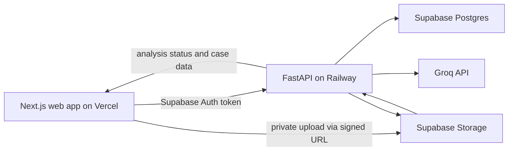

# Architecture

## System design

## Responsibilities

| Component | Responsibility |
| --- | --- |
| Next.js app | Authentication screens, dashboard, dedicated upload flow, document reader, read-only review workspace, citation navigation, and API state. |
| FastAPI | Verifies the user token, issues signed upload URLs, parses documents, calls AI, validates citations, writes analysis outputs, and exposes REST endpoints. |
| Supabase Auth | Email/password identity and session JWTs. |
| Supabase Postgres | Case data, extracted evidence, analysis results, tasks, chat history, and activity history. |
| Supabase Storage | Private original documents; browser access occurs through temporary signed URLs only. |
| Groq API | Server-only structured analysis and synchronous evidence-grounded chat through `openai/gpt-oss-20b`. |

## Processing lifecycle

1. Frontend asks FastAPI for a signed path and upload URL.
2. Browser uploads directly to the private bucket.
3. Frontend registers the completed document with FastAPI.
4. FastAPI extracts text in the background and creates stable passages: PDF page/passages, DOCX paragraphs, or TXT passages. This completes Stage 2.
5. The user may type optional lawyer-provided context beside uploads. Stage 2 keeps it only in the browser; it remains separate from document evidence.
6. In Stage 3, the user selects **Analyze case** after at least one document is ready. FastAPI saves current context and copies it to the analysis-run snapshot.
7. FastAPI sends passage-labeled evidence and separately labeled lawyer-provided context to the AI with a JSON-only output contract.
8. FastAPI rejects any AI citation whose document ID, passage ID, or quoted text does not match stored evidence.
9. FastAPI stores valid fields, summaries, events, findings, tasks, and activity events.
10. Frontend polls analysis status and refreshes review views once the run reaches `completed`; the case status becomes `review`.
11. Case chat ranks ready passages deterministically, adds bounded recent history and separately labeled confirmed lawyer-reviewed context, then validates Groq citations before atomically saving a successful exchange.

## Data model

| Entity | Purpose |
| --- | --- |
| `profiles` | Supabase user profile. |
| `cases` | Owner, Case ID, case name, and preparation status. Stage 3 adds current lawyer-provided context. |
| `documents` | File metadata, private storage path, extraction status, and safe error message. Document summaries are stored per analysis run. |
| `document_passages` | Stable evidence units used by every citation. |
| `case_fields` | Pending/confirmed/rejected extracted details and citations. |
| `analysis_runs` | Stage 3 processing history, errors, and immutable lawyer-context snapshot used by that run. |
| `document_summaries`, `case_fields`, `case_parties`, `timeline_events`, `findings`, `tasks` | Immutable run-scoped outputs. The workspace later selects the latest completed run by default. |
| `analysis_citations` | Normalized output-to-passage citation links; case-summary citations attach directly to an analysis run, while other citations attach to their run-scoped output row. Document metadata is derived through the cited passage. |
| `timeline_events` | Cited chronological events. |
| `findings` | Cited conflicts and gaps. |
| `tasks` | Run-scoped AI-proposed tasks with immutable wording and citations; Stage 4 permits status changes only. |
| `manual_tasks` | Owner-created case-scoped follow-up tasks. They have no citation or finding link and retain their own workflow state. |
| `chat_messages` | Immutable case-scoped user/assistant messages grouped by exchange and labeled as evidence or general guidance. |
| `chat_message_citations` | Assistant-message links to ready stored passages with validated verbatim quotes. |
| `activity_events` | Immutable history of AI and user actions. |

## Security rules

- Every case stores an `owner_id` referencing the authenticated user.
- Row Level Security permits only the case owner to read or write records belonging to that case.
- Storage bucket is private. Original documents never have public URLs.
- The frontend sends the Supabase bearer token to FastAPI; FastAPI verifies it before accessing any case.
- Lawyer-provided context is a separately labeled lawyer assertion, never document evidence or a valid citation source.
- The evidence assembler reads only ready passages in deterministic order and rejects a complete prompt above 180,000 characters rather than truncating evidence.
- The citation gate retains an output only when an NFKC/whitespace-normalized quote is present in its cited stored passage. The case summary needs a valid citation or the entire result fails before persistence.
- `GROQ_API_KEY`, Supabase service credentials, and JWT secrets remain in Railway environment variables only.
- The Stage 3.2 Groq client uses `https://api.groq.com/openai/v1/chat/completions` with `openai/gpt-oss-20b`, JSON-object mode, hidden low-effort reasoning, and Pydantic output validation. It is server-only and does not write database records directly.

## Deployment

- Deploy `apps/web` to Vercel with `NEXT_PUBLIC_SUPABASE_URL`, `NEXT_PUBLIC_SUPABASE_ANON_KEY`, and `NEXT_PUBLIC_API_BASE_URL`.
- Deploy FastAPI to Railway with Supabase credentials, Groq credentials, and `ALLOWED_ORIGINS` set to the Vercel URL.
- Run Supabase migrations before deploying the API.

## Current delivery status

The implementation covers private intake, analysis, source-linked review, lawyer review/task mutations, and synchronous case chat. The browser talks only to FastAPI. Chat sends at most 20 ready passages and 60,000 evidence characters, the latest 20 messages, and confirmed reviewed details in a non-evidence section. Reads return at most the latest 100 messages.

## Stage 4 review boundary

Stage 4 never rewrites an AI field, party, task, or its normalized citations. The `case_fields` and `case_parties` review columns hold the lawyer's effective replacement and reviewer metadata separately. `manual_tasks` are case-scoped owner records with no analysis run, citation, or finding reference. Security-invoker RPCs validate the active owned case, write one change, and append a safe activity event atomically under the caller JWT.

## Stage 5 chat boundary

Only ready passages from the active owned case are citation sources. Conversation history and confirmed lawyer-reviewed values guide the answer in labeled non-evidence sections. Evidence responses require one to five quote-matched citations. General guidance has no citations and carries the required non-evidence prefix. The security-invoker save RPC writes both messages, citations, and one safe activity event in a single transaction.
