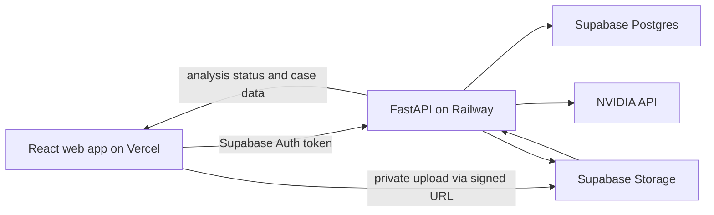

# Architecture

## System design

## Responsibilities

| Component | Responsibility |
| --- | --- |
| React app | Authentication screens, dashboard, case workspace, upload experience, document reader, task review, chat, and API state. |
| FastAPI | Verifies the user token, issues signed upload URLs, parses documents, calls AI, validates citations, writes analysis outputs, and exposes REST endpoints. |
| Supabase Auth | Email/password identity and session JWTs. |
| Supabase Postgres | Case data, extracted evidence, analysis results, tasks, chat history, and activity history. |
| Supabase Storage | Private original documents; browser access occurs through temporary signed URLs only. |
| NVIDIA API | Structured extraction, case analysis, summaries, and chat answer generation. |

## Processing lifecycle

1. Frontend asks FastAPI for a signed path and upload URL.
2. Browser uploads directly to the private bucket.
3. Frontend registers the completed document with FastAPI.
4. The user selects **Analyze case**.
5. FastAPI extracts text and creates stable passages: PDF page/passages, DOCX paragraphs, or TXT passages.
6. FastAPI sends passage-labeled text to the AI with a JSON-only output contract.
7. FastAPI rejects any AI citation whose document ID, passage ID, or quoted text does not match stored evidence.
8. FastAPI stores valid fields, summaries, events, findings, tasks, and activity events.
9. Frontend polls analysis status and refreshes each view when status reaches `review` or `ready`.

## Data model

| Entity | Purpose |
| --- | --- |
| `profiles` | Supabase user profile. |
| `cases` | Owner, Case ID, case name, preparation status. |
| `documents` | File metadata, storage path, parse status, error, AI summary. |
| `document_passages` | Stable evidence units used by every citation. |
| `case_fields` | Pending/confirmed/rejected extracted details and citations. |
| `analysis_runs` | Processing history and errors. |
| `timeline_events` | Cited chronological events. |
| `findings` | Cited conflicts and gaps. |
| `tasks` | AI/manual task and status. |
| `chat_messages` | Case-scoped conversation and citations. |
| `activity_events` | Immutable history of AI and user actions. |

## Security rules

- Every case stores an `owner_id` referencing the authenticated user.
- Row Level Security permits only the case owner to read or write records belonging to that case.
- Storage bucket is private. Original documents never have public URLs.
- The frontend sends the Supabase bearer token to FastAPI; FastAPI verifies it before accessing any case.
- `NVIDIA_API_KEY`, Supabase service credentials, and JWT secrets remain in Railway environment variables only.

## Deployment

- Deploy `apps/web` to Vercel with `VITE_SUPABASE_URL`, `VITE_SUPABASE_ANON_KEY`, and `VITE_API_BASE_URL`.
- Deploy FastAPI to Railway with Supabase credentials, NVIDIA credentials, and `ALLOWED_ORIGINS` set to the Vercel URL.
- Run Supabase migrations before deploying the API.
